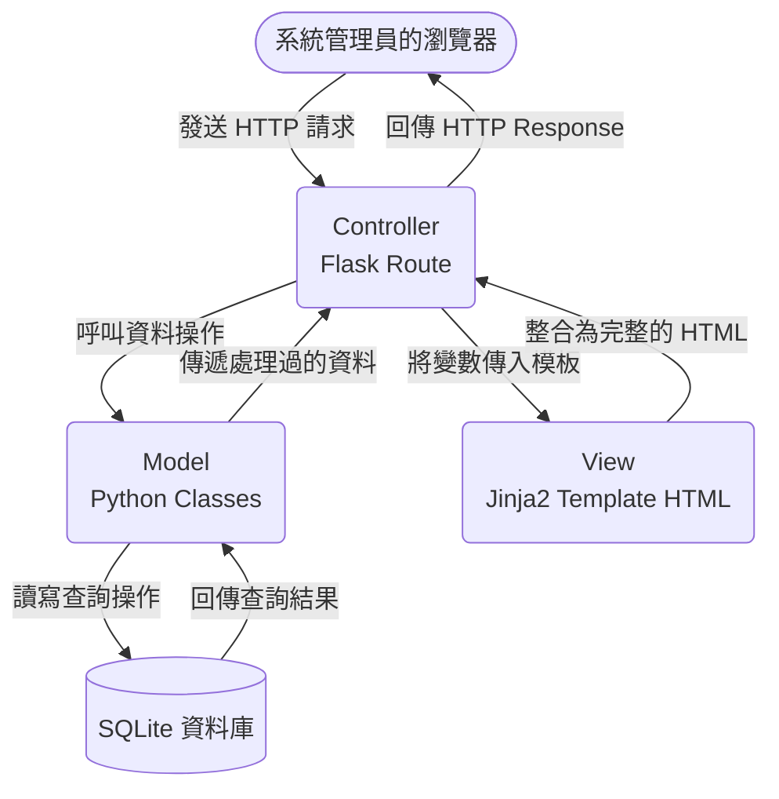

# 系統架構設計文件：圖書館理系統

## 1. 技術架構說明
本專案採用典型的單體式架構（Monolithic Architecture）與 MVC（Model-View-Controller）設計模式。
- **選用技術與原因**：
  - **後端（Python + Flask）**：輕量、易於建立原型的 Web 框架，能快速搭建功能並進行迭代開發。
  - **模板引擎（Jinja2）**：與 Flask 緊密整合，能快速渲染動態 HTML 頁面，無須前後端分離，大幅降低初期開發複雜度。
  - **資料庫（SQLite）**：輕量且無須額外設定檔案伺服器的關聯式資料庫，非常適合本地端內部管理系統，足以滿足圖書館的館藏維護與借閱資料管理需求。
- **Flask MVC 模式說明**：
  - **Model（模型）**：負責與 SQLite 資料庫進行互動以處理資料操作（CRUD），並確保資料一致性（例如管理書籍、會員以及借閱等實體結構）。
  - **View（視圖）**：負責前端介面呈現。藉由 Jinja2 模板接收由 Controller 傳遞的資料，結合 HTML 與 CSS 生成最終頁面並交由瀏覽器渲染。
  - **Controller（控制器/路由）**：在 Flask 中透過 Routing（如 `@app.route`）負責接收網頁請求、呼叫對應的 Model 處理商業邏輯後，並指定由哪一個 View 去渲染並返回結果。

## 2. 專案資料夾結構

本系統預計建立如下的資料夾結構，以利於模組分工與後續維護：
```text
web_app_development/
├── app/                  ← 應用程式主體（包含 MVC 所有核心內容）
│   ├── models/           ← 資料庫模型 (Model)
│   │   ├── __init__.py
│   │   ├── book.py       ← 定義書籍相關欄位
│   │   ├── member.py     ← 定義會員相關欄位
│   │   └── record.py     ← 定義借閱紀錄與關聯
│   ├── routes/           ← Flask 路由 (Controller)
│   │   ├── __init__.py
│   │   ├── book_routes.py    ← 處理書籍新增、尋找等邏輯
│   │   ├── member_routes.py  ← 處理會員建檔等邏輯
│   │   ├── record_routes.py  ← 處理借還書操作邏輯
│   │   └── dashboard_routes.py ← 首頁儀表板與熱門排行
│   ├── templates/        ← Jinja2 HTML 模板 (View)
│   │   ├── base.html     ← 共用版型（主要導覽列、頁尾與共用資源）
│   │   ├── books/        ← 書籍的清單、編輯頁面 HTML
│   │   ├── members/      ← 會員的清單、編輯頁面 HTML
│   │   └── records/      ← 借還書紀錄的畫面與表單
│   └── static/           ← 前端靜態資源檔案
│       ├── css/
│       │   └── style.css
│       └── js/
│           └── main.js
├── instance/             ← 負責存放內部動態生成的資料
│   └── database.db       ← 系統使用的 SQLite 資料庫檔案
├── docs/                 ← 專案文件目錄
│   ├── PRD.md            ← 產品需求文件
│   └── ARCHITECTURE.md   ← 系統架構文件 (本文件)
├── app.py                ← 應用程式的啟動入口
└── requirements.txt      ← Python 相關依賴套件清單
```

## 3. 元件關係圖

透過網頁請求的歷程，呈現前端至後端再將結果送回的流程：



## 4. 關鍵設計決策

1. **優先採用 Server-Side Rendering (SSR) 不使用前後端分離 API 架構**
   - **原因**：圖書館理系統著重的是資料的管理性與精準的 CRUD 操作。直接使用 Flask + Jinja2 渲染 HTML 可以避免早期開發大量 RESTful API 以及處理前端路由的複雜度，使系統在初期 MVP 階段即可快速交付使用。
2. **基於商業領域邏輯的目錄拆分 (Blueprints / Routes)**
   - **原因**：避免所有的 API 與路由都被塞進一個厚重的 `app.py` 中。將書籍 (Books)、會員 (Members)、借閱記錄 (Records) 獨立成自己專屬的檔案與模板目錄，能讓職責更單一化（Separation of Concerns），並大幅降低多人協作時的衝突風險。
3. **採用關聯式資料庫處理強關聯性（RDBMS 模型）**
   - **原因**：「借閱記錄」是連接「會員」與「書籍」的關聯表，具有強烈的一對多（One-to-Many）與多對多（Many-to-Many）關係。使用關聯式實體的資料庫架構能很好地保證一致性（如：同一本書不能同時被借出超過庫存），且有利於之後執行 JOIN 語法來快速產出「書籍熱門排行統計」。
4. **統一的共用模板 (base.html) 以維持視覺一致性**
   - **原因**：圖書館理系統有許多操作頁面，建立 `base.html` 並引入所有頁面共同需要的前端套件（如 CSS、基礎 JS、導覽列），能保證所有子系統的操作體驗一致，並且方便後續更換視覺主題。
