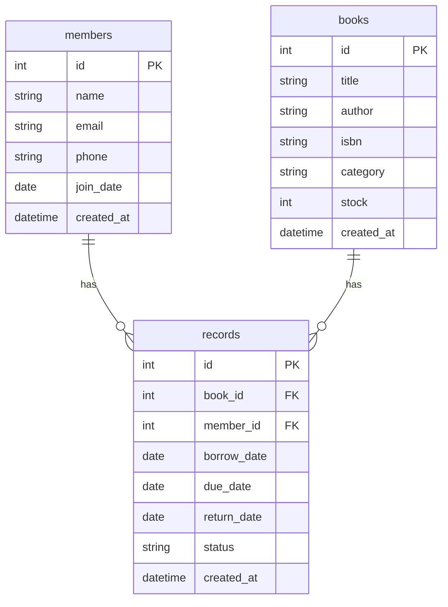

# 資料庫設計文件：圖書館理系統

本文件根據專案需求與流程，設計圖書館理系統的 SQLite 資料表結構與關聯，作為後續開發資料庫模型 (Model) 的基礎。

## 1. ER 圖（實體關係圖）

## 2. 資料表詳細說明

### 2.1 書籍表 (books)
負責儲存所有館藏書籍資料。

| 欄位名稱 | 型別 | 必填 | 說明 |
| --- | --- | --- | --- |
| id | INTEGER | 是 | Primary Key (AUTOINCREMENT) |
| title | TEXT | 是 | 書名 |
| author | TEXT | 是 | 作者 |
| isbn | TEXT | 否 | 國際標準書號 |
| category | TEXT | 否 | 分類 (如：文學、科技) |
| stock | INTEGER | 是 | 目前在庫可借閱數量 (預設 >= 0) |
| created_at | TEXT | 否 | 建立時間 (ISO 8601 格式) |

### 2.2 會員表 (members)
負責儲存讀者資料。

| 欄位名稱 | 型別 | 必填 | 說明 |
| --- | --- | --- | --- |
| id | INTEGER | 是 | Primary Key (AUTOINCREMENT) |
| name | TEXT | 是 | 姓名 |
| email | TEXT | 否 | 聯絡信箱 |
| phone | TEXT | 否 | 聯絡電話 |
| join_date | TEXT | 否 | 註冊日期 (ISO 8601 格式 YYYY-MM-DD) |
| created_at | TEXT | 否 | 建立時間 (ISO 8601 格式) |

### 2.3 借閱紀錄表 (records)
負責儲存會員與書籍之間的借閱關聯，並記錄借還狀態。

| 欄位名稱 | 型別 | 必填 | 說明 |
| --- | --- | --- | --- |
| id | INTEGER | 是 | Primary Key (AUTOINCREMENT) |
| book_id | INTEGER | 是 | Foreign Key 關聯至 `books.id` |
| member_id | INTEGER | 是 | Foreign Key 關聯至 `members.id` |
| borrow_date | TEXT | 是 | 借閱日期 (ISO 8601 格式 YYYY-MM-DD) |
| due_date | TEXT | 是 | 應歸還日期 (ISO 8601 格式 YYYY-MM-DD) |
| return_date | TEXT | 否 | 實際歸還日期 (ISO 8601 格式 YYYY-MM-DD) |
| status | TEXT | 是 | 借閱狀態 ('borrowed' 或 'returned') |
| created_at | TEXT | 否 | 建立時間 (ISO 8601 格式) |
