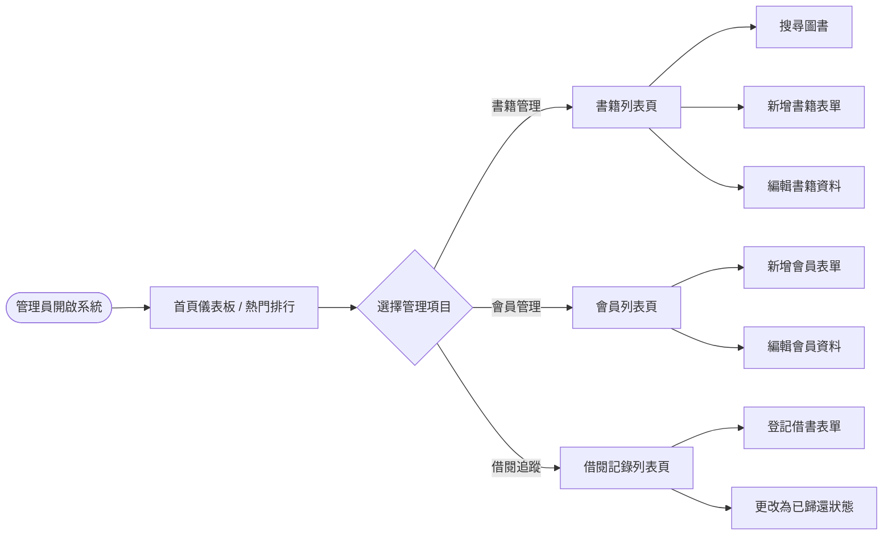
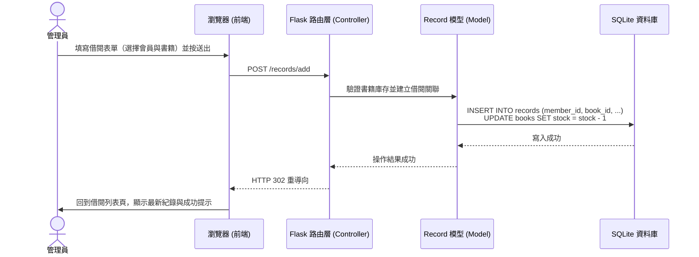

# 系統流程圖：圖書館理系統

本文件涵蓋圖書館理系統的使用者操作流程（User Flow）、核心功能的系統序列圖（Sequence Diagram）以及對應的路由與功能清單對照表。

## 1. 使用者流程圖（User Flow）

描繪管理員進入系統後，操作各項主要功能的動線與步驟。

## 2. 系統序列圖（Sequence Diagram）

以「管理員登記讀者借閱一本書籍」為例，展示完整的資料流與系統互動過程：

## 3. 功能清單對照表

以下為系統中主要功能對應的 URL 路徑與 HTTP 方法的詳細清單，將作為後續實作（API 路由開發與前端表單對接）的基礎：

| 功能區域 | 詳細功能 | URL 路徑 | HTTP 方法 | 說明 |
| --- | --- | --- | --- | --- |
| **首頁與儀表板** | 檢視儀表板與熱門出借排行 | `/` (或 `/dashboard`) | GET | 顯示系統整體的概況與熱門推薦清單 |
| **書籍管理** | 書籍列表與搜尋 | `/books` | GET | 顯示所有館藏書籍，可透過 Query 參數完成搜尋篩選 |
| **書籍管理** | 新增書籍 | `/books/add` | GET, POST | GET: 顯示填寫表單 / POST: 接收表單並存入資料 |
| **書籍管理** | 編輯書籍 | `/books/<id>/edit` | GET, POST | GET: 顯示欲編輯的原始資料表單 / POST: 更新資料庫 |
| **會員管理** | 會員列表 | `/members` | GET | 顯示所有在案會員的資料清單 |
| **會員管理** | 新增會員 | `/members/add` | GET, POST | GET: 顯示會員註冊的表單 / POST: 接收並建立新會員 |
| **會員管理** | 編輯會員 | `/members/<id>/edit` | GET, POST | GET: 顯示會員資料表單 / POST: 覆寫更新會員資訊 |
| **借閱管理** | 借閱記錄列表 | `/records` | GET | 顯示目前所有歷史借閱及歸還紀錄清單 |
| **借閱管理** | 登記借出作業 | `/records/add` | GET, POST | GET: 顯示借書表單選項 / POST: 建立新的借閱實體並扣除庫存 |
| **借閱管理** | 登記歸還作業 | `/records/<id>/return` | POST | 直接接收 POST 變更紀錄為已歸還，並恢復書籍庫存數量 |
